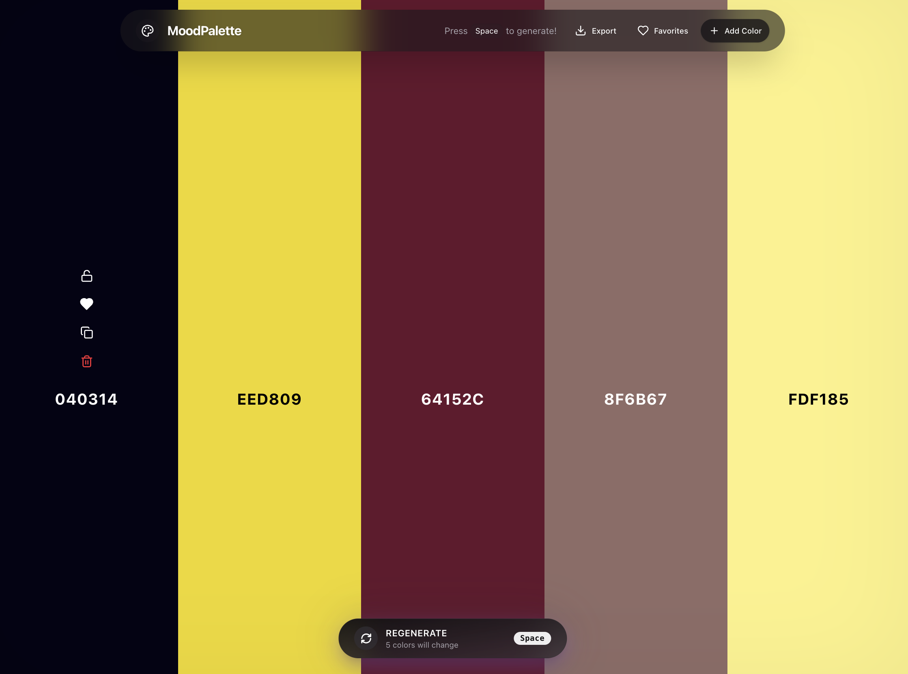

# 🎨 MoodPalette

A modern, fast, and beautiful color palette generator and editor built for designers and developers.

  

    
    
    
    
    
    
  

---

## 📖 Table of Contents

- [About the Project](#-about-the-project)
- [Key Features](#-key-features)
- [Tech Stack](#-tech-stack)
- [Getting Started](#-getting-started)
- [Project Architecture](#-project-architecture)

## 🎯 About the Project

**MoodPalette** is a lightning-fast tool for generating, editing, and exporting stunning color palettes. It brings the best practices of modern web development and design systems into a seamless, interactive experience. Tweak colors, lock favorites, and export them directly to your CSS or Tailwind configuration.

## ✨ Key Features

- **Instant Generation**: Press `Space` to instantly generate a new, harmonious color palette.
- **Interactive Editing**: Click any HEX code to manually edit it, or rely on auto-generation.
- **Granular Control**: Lock specific colors you like while generating new ones around them.
- **Favorites System**: Heart your favorite colors and access them anytime from a dedicated sidebar (persisted locally).
- **Shareable URLs**: The URL automatically updates with your current palette, making bookmarking and sharing effortless.
- **Developer-Friendly Exports**: One-click export your palette or favorites to CSS variables, Tailwind config, or raw JSON.
- **Accessibility First**: Full keyboard support and screen-reader-friendly UI out of the box.

## 🛠 Tech Stack

### Frontend & UI

- **Framework**: [Next.js 15 (App Router)](https://nextjs.org/)
- **Library**: [React 19](https://react.dev/)
- **Styling**: [Tailwind CSS v4](https://tailwindcss.com/)
- **Animations**: [Framer Motion v12](https://www.framer.com/motion/)
- **Icons**: [Lucide React](https://lucide.dev/)

### State Management & Tooling

- **State Management**: [Zustand](https://github.com/pmndrs/zustand) (with targeted selectors for performance)
- **Language**: [TypeScript](https://www.typescriptlang.org/)
- **Code Quality**: Strict type checking.

## 🚀 Getting Started

### Prerequisites

You need Node.js and a package manager (npm, pnpm, or yarn) installed.

### Installation

1. Clone the repository
   \`\`\`bash
   git clone <repository-url>
   \`\`\`
2. Navigate to the project directory
   \`\`\`bash
   cd design-system-color-editor
   \`\`\`
3. Install dependencies
   \`\`\`bash
   npm install
   \`\`\`
4. Start the development server
   \`\`\`bash
   npm run dev
   \`\`\`

Open [http://localhost:3000](http://localhost:3000) with your browser to see the result.
